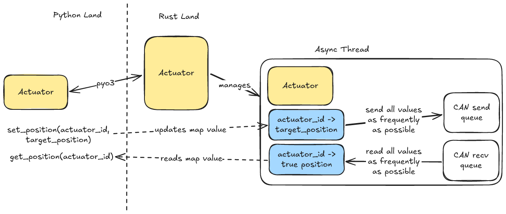

# actuator

Defines a package to make it easy and performant to control actuators.



## Getting Started

### Install Build Dependencies

#### Ubuntu

```bash
sudo apt install pkg-config libudev-dev
```

### Install the Package

```bash
pip install actuator
```

Alternatively, to install the bleeding edge version from Github:

```bash
pip install 'actuator @ git+https://github.com/kscalelabs/actuator.git@master'
```

### Motor-Specific Examples

#### Robstride

The following example can be used to move a Robstride motor in a sinusoidal pattern.

```bash
python -m actuator.examples.sinusoidal_movement
```

Note that there are some additional steps needed before the Robstride USB controller will work on Linux:

1. Install [this driver](https://github.com/WCHSoftGroup/ch341ser_linux) for the CH341 USB controller.
2. This should create a `/dev/ttyUSB0` or `/dev/ttyCH341USB0` device - you should check which one by doing `ls /dev/tty*`.
You might need to the change the permissions:

```bash
sudo chmod 666 /dev/ttyCH341USB0
```

3. Run the following command to configure the baud rate of the controller:

```bash
sudo stty -F /dev/ttyUSB0 921600
```

4. Alternatively, you can add the following line to your `/etc/udev/rules.d/51-ch340.rules` file to automatically configure the baud rate:
```bash
KERNEL=="ttyCH341USB[0-9]", ATTRS{idVendor}=="1a86", ATTRS{idProduct}=="7523", SYMLINK+="ttyUSB%n", RUN+="/bin/stty -F /dev/ttyCH341USB0 921600"
KERNEL=="ttyUSB[0-9]", ATTRS{idVendor}=="1a86", ATTRS{idProduct}=="7523", RUN+="/bin/stty -F /dev/ttyUSB0 921600"
```

5. After adding the above rule, you should run `sudo udevadm control --reload-rules` to reload the rules.


## Supported Actuators

- [Robstride](https://robstride.com/)
